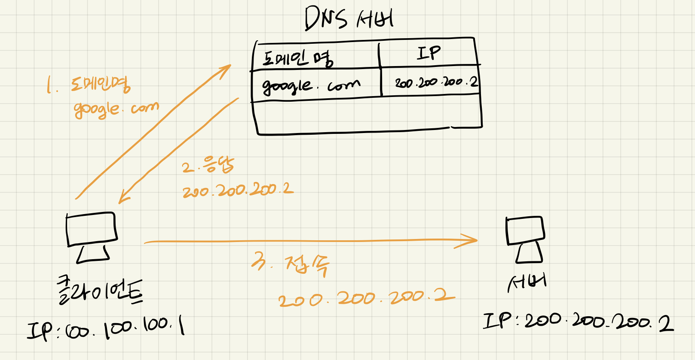

## 인터넷 네트워크

### 인터넷 통신

- 인터넷에서 컴퓨터 둘은 어떻게 통신할까?
  - 클라이언트 - 인터넷 - 서버

### IP (인터넷 프로토콜)

- IP 주소 부여
  - ex. 클라이언트 IP : 100.100.100.1 / 서버 IP : 200.200.200.2

- IP 역할

  - **지정한 IP 주소에** 데이터 전달, **패킷이라는 통신 단위**로 데이터 전달

- IP 패킷 정보

  - 출발지 IP, 목적지 IP, 기타....
  - 전송 데이터

- IP 한계

  > 대상이 서비스 불능, 패킷 소실, 패킷 전달 순서 문제 발생

  - 비연결성
    - 패킷을 받을 대상 X  || 서비스 불능 상태여도 패킷 전송
    - 미국에 친구가 있겠지 하고 던졌는데, 미국 친구 pc가 OFF상태
    - 대상 서버가 패킷을 받을 수 있는 상태인지 모름
  - 비신뢰성
    - 중간에 패킷이 사라지면?
    - 패킷이 순서대로 안오면?
  - 프로그램 구분
    - 같은 IP를 사용하는 서버에서 통신하는 애플리케이션이 둘 이상?

### TCP

- 인터넷 프로토콜 스택의 4계층

  - 애플리케이션 계층 - HTTP, FTP

    전송 계층 - TCP, UDP

    인터넷 계층 - IP

    네트워크 인터페이스 계층 

- 
  1. 프로그램이 'Hello, world!' 메시지 생성
  2. SOCKET 라이브러리를 통해 전달
  3. TCP 정보 생성 (**메시지 데이터 포함**)
  4. IP 패킷 생성 (**TCP 데이터 포함**)
  5. LAN 카드 통해서 **물리적인 정보 포함**
  6. Ethernet frame 포함해서 LAN카드 통해서 나감 (Ethernet frame: LAN카드에 등록된 맥주소 같은 물리적인 정보 포함)

- IP 패킷 정보

  - 출발지 IP, 목적지 IP, 기타...
  - 전송 데이터

- TCP 세그먼트

  - 출발지 포트, 목적지 포트, 전송 제어 정보, **순서**, 검증 정보...
  - 전송 데이터

- TCP 특징

  - 전송 제어 프로토콜 (Transmission Control Protocol)

  - 연결 지향 - TCP 3 way handshake (가상 연결)

    - 먼저 연결을 하고 메세지를 보냄 

    - SYN : 접속 요청 , ACK : 요청 수락

    - 1. 클라이언트 -> 서버 (**SYN**)

      2. 서버 -> 클라이언트 (SYN + ACK)

      3. 클라이언트 -> 서버 (**ACK**)     (* 이 때, 함께 데이터 전송 가능)

         ------------------connect , 연결 과정---------------------

      4. 데이터 전송

    - 논리적 연결이 된 것임, 중간에 있는 수많은 서버(노드)들은 연결이 된건지 모름

  - 데이터 전달 보증

    - 패킷이 중간에 누락되면 알 수 있음
    - 서버에서 데이터 잘 받았다고 알려줌 (아무 응답 없으면 문제가 있음을 인지 가능)

  - 순서 보장

    - 1. 패킷1, 2, 3 순서로 전송
      2. 패킷1, 3, 2 순서로 전송
      3. 패킷2부터 다시 보내! (서버 -> 클라이언트)

  - 신뢰할 수 있는 프로토콜

  - 현재는 대부분의 애플리케이션에서 TCP 사용

### UDP

- 사용자 데이터그램 프로토콜 (User Datagram Protocol)
  - 기능이 거의 없음
  - 연결 지향 - TCP 3 way handshake (가상 연결) X
  - 데이터 전달 보증 X
  - 순서 보장 X
  - **데이터 전달 및 순서가 보장되지 않지만, 단순하고 빠름**
  - IP와 거의 같지만 **PORT, 체크섬 추가!!!!!!**
    - TCP에서의 IP 프로토콜에는 포트가 없음
    - 하나의 IP에서 여러 종류의(애플리케이션의) 패킷을 받아야 할 때 포트를 나눠서 받음
    - 체크섬: 메세지 검증 데이터
  - 요새 각광 받음
    - 웹 브라우저에서 HTTP 통신할때 (최근, HTTP 3) 핸드쉐이킹할 때 과정도 줄여보자.. 최적화 해보자.. 해서 UDP 프로토콜 사용

### PORT

- IP : 목적지 서버를 찾는 것 (아파트)

  PORT : 서버 안에서 돌아가는 애플리케이션 구분 (몇동 몇호)

- **같은 IP 내에서 프로세스 구분**

- 0 ~ 65535 할당 가능

  0 ~ 1023 : 잘 알려진 포트, 사용하지 않는 것이 좋음

  FTP - 20, 21

  TELNET - 23

  HTTP - 80

  HTTPS - 443

### DNS

- 도메인 네임 시스템 (Domain Name System)
- IP는 기억하기 어렵다. (200.200.200.2 ???????)
- IP는 변경될 수 있다.
- 중간에 전화번호부같은 서버 제공
- 도메인 명을 IP 주소로 변환 