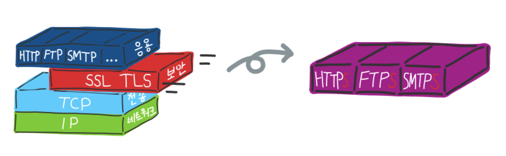
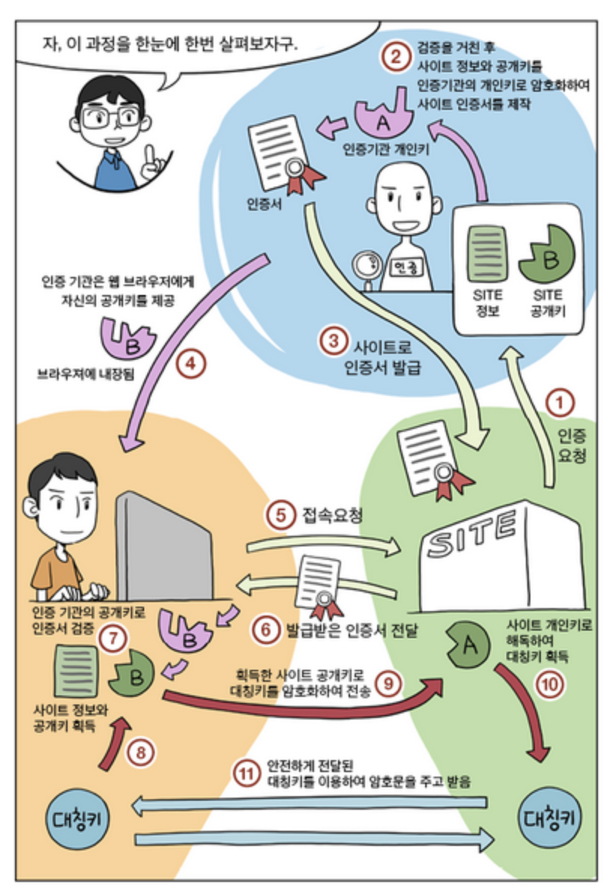

## SSL (Security Socket Layer)

### SSL이란?

- 보안 소켓 레이어

- 443포트 사용, https:// 사용

  - https를 통한 인터넷 접속 -> 브라우저를 실행 중인 컴퓨터(or 휴대폰)가 해당 사이트의 서버와 암호화 통신을 하고있다는 것을 의미함

- HTTPS와 SSL은 다르다!

  

  - SSL (TLS와 같은 의미, TLS가 SSL의 후속 버전)은 **'보안 계층'**이라는 독립적인 프로토콜 계층을 만들어 응용계층과 전송계층 사이에 존재

  - HTTPS는 SSL 또는 TLS 위에 HTTP 프로토콜을 얹어 보안된 HTTP 통신을 하는 프로토콜

    즉, SSL (or TLS)는 HTTP 뿐만 아니라 FTP, SMTP와 같이 다른 프로토콜에도 적용 가능

    HTTPS는 SSL과 HTTP가 조합된 프로토콜만을 가리킴!

- SSL 암호화 통신 과정

  ​	

  1. 클라이언트(웹 브라우저)가 SSL로 암호화된 페이지를 요청한다 (https)

  2. 서버(웹 서버)는 Public key를 인증서와 함께 전송한다.

  3. 클라이언트는 인증서가 Trusted root CA(인증기관)로부터 서명된 것인지, 날짜 등이 유효한지를 확인한다.

  4. 인증을 확인한 클라이언트는 Public key로 URL, http 데이터들과 자신의 랜덤 대칭 암호화 키를 암호화하여 전송한다.

  5. 서버는 인증서에 대한 Private key로 요청을 복호화하여 전달받은 대칭키로 응답을 암호화해서 전송한다.

  6.  브라우저는 대칭키로 응답을 복호화해서 사용자에게 보여준다.

> 참고
>
> https://donghwi-kim.github.io/jekyll/update/2015/02/21/SSL.html
>
> https://blog.naver.com/skinfosec2000/222135874222
>
> https://captcha.tistory.com/51
>
> https://jins-dev.tistory.com/entry/SSL-%EC%9D%B4%EB%9E%80-SSL-%EC%97%90-%EB%8C%80%ED%95%9C-%EC%A0%95%EB%A6%AC