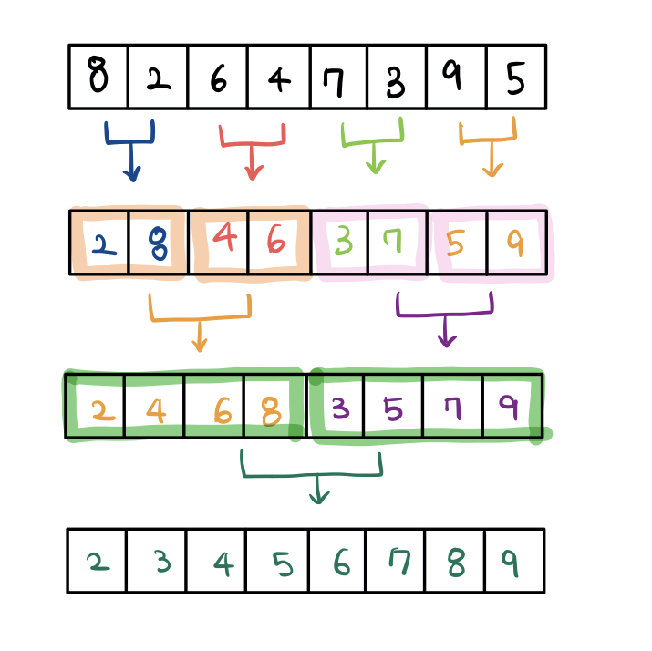

# 선택정렬

- 제자리 정렬 (in-place sorting) 알고리즘 중 하나
  - 입력 배열 (정렬되지 않은 값들) 이외에 다른 추가 메모리를 요구하지 않는 정렬 방법
  - 해당 순서에 원소를 넣을 위치는 이미 정해져 있고, 어떤 원소를 넣을지 선택하는 알고리즘
- 로직
  - 먼저, 가장 첫번째 인덱스를 기준점으로 놓고 그 다음부터 배열의 가장 작은 값을 고른다
  - 가장 첫번째 값, 고른 가장 작은 값을 swap
  - 다시 기준점은 두번째로 넘어감
  - swap 반복
  - 기준점이 배열의 가장 마지막 인덱스에 도달하면 정렬 끝!

- 복잡도
  - 시간 
    - 비교 횟수
      - 두 개의 for 루프 
      - **외부** 루프 **(n-1) 번**
      - **내부** 루프 **n-1, n-2, .... , 2, 1 번**
    - 교환 횟수
      - 외부 루프의 실행 횟수와 동일함 -> 상수 시간 작업
      - 한 번 교환하기 위하여 3번의 이동(swap) -> **3(n-1) 번**
    - T(n) = (n-1) + (n-2) + ... + 2 + 1 = n(n-1)/2 = **O(n^2)**
  - 공간 
    - O(n) - 단 하나의 배열에서만 진행

```java
void selectionSort(int[] arr) { 
  int indexMin, temp; 
  for (int i = 0; i < arr.length-1; i++) { 
    // 1. 
    indexMin = i; 
    for (int j = i + 1; j < arr.length; j++) { 
      // 2. 
      if (arr[j] < arr[indexMin]) { 
        // 3. 
        indexMin = j; 
      } 
    } 
    // 4. swap(arr[indexMin], arr[i]) 
    temp = arr[indexMin]; 
    arr[indexMin] = arr[i]; 
    arr[i] = temp; 
  } 
  System.out.println(Arrays.toString(arr)); 
}
```


# 버블 정렬

- **서로 인접한 두 원소를 검사하여 정렬하는 알고리즘**
  - 인접한 2개의 레코드를 비교하여 크기가 순서대로 되어 있지 않으면 서로 교환함

- 로직
  - 1회전 수행 뒤, 가장 큰 자료가 맨 뒤로 감 -> 2회전 수행시 맨 뒤 자료는 제외
  - 2회전 수행 뒤, 두번째로 큰 자료가 맨 뒤에서 두번째 자리로 감
  - 이렇게 각 회전 수행할 때마다 정렬에서 제외되는 데이터가 하나씩 늘어남
- 시간 복잡도
  - 비교 횟수
    - 최상, 평균, 최악 모두 일정
    - n-1, n-2, ... , 2, 1번 = n(n-1) / 2
  - 교환 횟수
    - 입력 자료가 역순으로 되어있을 경우 -> 한번 교환하면 3번 이동해야함
    - 3n(n-1)/2
    - 입력 자료가 이미 정렬되어 있는 최상의 경우, 자료 이동 발생 X
  - T(n) = **O(n^2)**

```java
public static void bubleSort(int[] arr) {
    for(int i = 0; i < arr.length; i++) {
        for(int j = 0 ; j < arr.length - i - 1 ; j++) {
            if(arr[j] > arr[j+1]) {
                int temp = arr[j+1];
                arr[j+1] = arr[j];
                arr[j] = temp;
            }
        }
    }
}
```


# 삽입 정렬

- 두 번째 자료부터 시작하여 그 앞의 자료들과 비교하여 삽입할 위치를 지정한 후, 자료를 뒤로 옮기고 지정한 자리에 자료를 삽입하여 정렬하는 알고리즘

  - ex.  2 <--비교--> 1 

    ​       3 <--비교--> 2, 1

    ​       4 <--비교--> 3, 2, 1

  - 자료가 삽입 될 위치 찾으면, 그 위치에 자료 삽입해야하므로 다른 자료들을 한 칸씩 뒤로 이동시킴

- 처음 key값은 두번째 자료부터 시작


```java
public static void insertionSort(int[] arr) {
  for (int key = 1; key < arr.length; key++) {
    for (int i = key; i > 0; i--) {
      if (arr[i - 1] > arr[i])
        swap(arr, i - 1, i);
    }
  }
}
```


- 시간 복잡도
  - 최악 (입력 자료가 역순)
    - 비교 횟수
      - 외부 루프 안의 각 반복마다 i번의 비교 수행
      - 외부 루프 : (n-1) + (n-2) + ... + 2 + 1 = n(n-1)/2 = **O(n^2)**
    - 교환 횟수
      - 외부 루프의 각 단계마다 (i+2)번의 이동 발생
      - n(n-1)/2 + 2(n-1) = (n^2 + 3n - 4) / 2 = O(n^2)


# 합병 정렬

- 분할 정복 알고리즘의 하나
  - 분할 정복
    - 문제를 작은 문제들로 분리하고 해결한 다음, 결과를 모아서 원래의 문제를 해결
    - 대개 순환 호출을 이용하여 구현
- 레코드를 배열로 구성하면 임시 배열이 필요
  - 제자리 정렬 (in-place sorting)이 아님
- 연결 리스트로 구성하면 제자리 정렬로 구현 가능
  - 링크 인덱스만 변경되므로 데이터의 이동은 무시 할 수 있을 정도로 작아짐
- 로직
  - 분할 : 입력 배열을 같은 크기의 2개의 부분 배열로 분할
  - 정복 : 부분 배열을 정렬 (**부분 배열의 크기가 충분히 작지 않으면 순환 호출을 이용하여 다시 분할 정복 방법 적용**)
  - 결합 : 정렬된 부분 배열들을 하나의 배열에 합병


> Top-Down 방식 (재귀)

```java
public class Merge_Sort {
 
	private static int[] sorted;		// 합치는 과정에서 정렬하여 원소를 담을 임시배열
	
	public static void merge_sort(int[] a) {
		
		sorted = new int[a.length];
		merge_sort(a, 0, a.length - 1);
		sorted = null;
	}
	
	// Top-Down 방식 구현
	private static void merge_sort(int[] a, int left, int right) {
		
		/*
		 *  left==right 즉, 부분리스트가 1개의 원소만 갖고있는경우 
		 *  더이상 쪼갤 수 없으므로 return한다.
		 */
		if(left == right) return;
		
		int mid = (left + right) / 2;	// 절반 위치 
		
		merge_sort(a, left, mid);		// 절반 중 왼쪽 부분리스트(left ~ mid)
		merge_sort(a, mid + 1, right);	// 절반 중 오른쪽 부분리스트(mid+1 ~ right)
		
		merge(a, left, mid, right);		// 병합작업
		
	}
	
	/**
	 * 합칠 부분리스트는 a배열의 left ~ right 까지이다. 
	 * 
	 * @param a		정렬할 배열
	 * @param left	배열의 시작점
	 * @param mid	배열의 중간점
	 * @param right	배열의 끝 점
	 */
	private static void merge(int[] a, int left, int mid, int right) {
		int l = left;		// 왼쪽 부분리스트 시작점
		int r = mid + 1;	// 오른쪽 부분리스트의 시작점 
		int idx = left;		// 채워넣을 배열의 인덱스
		
		
		while(l <= mid && r <= right) {
			/*
			 *  왼쪽 부분리스트 l번째 원소가 오른쪽 부분리스트 r번째 원소보다 작거나 같을 경우
			 *  왼쪽의 l번째 원소를 새 배열에 넣고 l과 idx를 1 증가시킨다.
			 */
			if(a[l] <= a[r]) {
				sorted[idx] = a[l];
				idx++;
				l++;
			}
			/*
			 *  오른쪽 부분리스트 r번째 원소가 왼쪽 부분리스트 l번째 원소보다 작거나 같을 경우
			 *  오른쪽의 r번째 원소를 새 배열에 넣고 r과 idx를 1 증가시킨다.
			 */
			else {
				sorted[idx] = a[r];
				idx++;
				r++;
			}
		}
		
		/*
		 * 왼쪽 부분리스트가 먼저 모두 새 배열에 채워졌을 경우 (l > mid)
		 * = 오른쪽 부분리스트 원소가 아직 남아있을 경우
		 * 오른쪽 부분리스트의 나머지 원소들을 새 배열에 채워준다.
		 */
		if(l > mid) {
			while(r <= right) {
				sorted[idx] = a[r];
				idx++;
				r++;
			}
		}
		
		/*
		 * 오른쪽 부분리스트가 먼저 모두 새 배열에 채워졌을 경우 (r > right)
		 * = 왼쪽 부분리스트 원소가 아직 남아있을 경우
		 * 왼쪽 부분리스트의 나머지 원소들을 새 배열에 채워준다.
		 */
		else {
			while(l <= mid) {
				sorted[idx] = a[l];
				idx++;
				l++;
			}
		}
		
		/*
		 * 정렬된 새 배열을 기존의 배열에 복사하여 옮겨준다.
		 */
		for(int i = left; i <= right; i++) {
			a[i] = sorted[i];
		}
	}
}
```


> Bottom-Up
>
> (merge 함수는 그대로, 부분리스트 나누는 과정만 Bottom-Up 방식으로 변경)

- 아래에서 위로 올라가서 결과가 됨

- 과정

  - 1. n개의 데이터를 1개로 다 자름

    2. 토너먼트 형식으로 데이터 두 개를 하나로 정렬을 하며 붙임

    3. 각각의 2개의 데이터를 하나로 정렬하며 붙임

    4. 각각의 4개의 데이터를 하나로 정렬하며 붙임

       .... 반복



```java
public class Merge_Sort {
 
	private static int[] sorted;		// 합치는 과정에서 정렬하여 원소를 담을 임시배열
	
	public static void merge_sort(int[] a) {
		
		sorted = new int[a.length];
		merge_sort(a, 0, a.length - 1);
		sorted = null;
	}
	
	// Bottom-Up 방식 구현
	private static void merge_sort(int[] a, int left, int right) {
		
		/*
		 * 1 - 2 - 4 - 8 - ... 식으로 1부터 서브리스트를 나누는 기준을 두 배씩 늘린다.
		 */
		for(int size = 1; size <= right; size += size) {
			
			/*
			 * 두 부분리스트을 순서대로 병합해준다.
			 * 예로들어 현재 부분리스트의 크기가 1(size=1)일 때
			 * 왼쪽 부분리스트(low ~ mid)와 오른쪽 부분리스트(mid + 1 ~ high)를 생각하면
			 * 왼쪽 부분리스트는 low = mid = 0 이고,
			 * 오른쪽 부분리스트는 mid + 1부터 low + (2 * size) - 1 = 1 이 된다.
			 *  
			 * 이 때 high가 배열의 인덱스를 넘어갈 수 있으므로 right와 둘 중 작은 값이
			 * 병합되도록 해야한다. 
			 */
			for(int l = 0; l <= right - size; l += (2 * size)) {
				int low = l;
				int mid = l + size - 1;
				int high = Math.min(l + (2 * size) - 1, right);
				merge(a, low, mid, high);		// 병합작업
			}
		}
	}
	
	/**
	 * 합칠 부분리스트는 a배열의 left ~ right 까지이다. 
	 * 
	 * @param a		정렬할 배열
	 * @param left	배열의 시작점
	 * @param mid	배열의 중간점
	 * @param right	배열의 끝 점
	 */
	private static void merge(int[] a, int left, int mid, int right) {
		/** Top-Down에서의 merge 메서드와 동일 */
	}
}
```


- 시간 복잡도
  - T(n) = 순환 호출의 깊이 만큼의 합병 단계 * 각 합병 단계의 비교 연산 = **O(nlog₂n)**


# 퀵 정렬

- 분할 정복 방법을 통해 정렬

- 합병 정렬과 달리 **리스트를 비균등하게 분할**

- Java에서 Arrays.sort() 내부적으로도 Dual Pivot Quick Sort로 구현

- 과정

  1. 하나의 원소 (피벗)을 고름
  2. 피벗을 기준으로 작은 요소들은 왼쪽, 큰 요소들은 오른쪽으로 옮겨 (**분할**)
  3. 분할된 두 개의 배열에 대해 재귀적으로 과정 반복
  4. 분할된 배열이 더 이상 분할 안될 때까지 반복 (크기가 0 or 1될때까지 반복)

  ``재귀가 한번 진행될 때마다 최소한 하나의 원소 (피벗)는 최종적으로 위치가 정해지므로, ``

  ``이 알고리즘은 반드시 끝난다는 것을 보장할 수 있음``


- 정복

```java
public void quickSort(int[] array, int left, int right) {
    if(left >= right) return;
    
    // 분할 
    int pivot = partition(); 
    
    // 피벗은 제외한 2개의 부분 배열을 대상으로 순환 호출
    quickSort(array, left, pivot-1);  // 정복(Conquer)
    quickSort(array, pivot+1, right); // 정복(Conquer)
}
```

- 분할

```java
public int partition(int[] array, int left, int right) {
    /**
    // 최악의 경우, 개선 방법
    int mid = (left + right) / 2;
    swap(array, left, mid);
    */
    
    int pivot = array[left]; // 가장 왼쪽값을 피벗으로 설정
    int i = left, j = right;
    
    while(i < j) {
        while(pivot < array[j]) {
            j--;
        }
        while(i < j && pivot >= array[i]){
            i++;
        }
        swap(array, i, j);
    }
    array[left] = array[i];
    array[i] = pivot;
    
    return i;
}
```


- 시간 복잡도
  - 최선
    - T(n) = nlog₂n
    - 비교 횟수 : log₂n (순환 호출의 깊이)
    - 각 순환 호출 단계의 비교 연산 : n
  - 최악
    - T(n) = O(n^2)
    - 비교 횟수 : n
    - 각 순환 호출 단계의 비교 연산 : n
- 공간 복잡도 : O(n)


# 힙 정렬

- 완전 이진 트리의 일종으로 우선순위 큐를 위하여 만들어진 자료구조
- 최댓값(최대힙, 내림차순), 최솟값(최소힙, 오름차순)을 쉽게 추출할 수 있음
- 시간 복잡도
  - 힙 트리의 전체 높이가 거의 log₂n(완전 이진 트리이므로)이므로 하나의 요소를 힙에 삽입하거나 삭제할 때 힙을 재정비하는 시간이 log₂n만큼 소요됨
  - 요소의 개수가 n개 이므로 전체적으로 O(nlog₂n)의 시간이 걸림
  - T(n) = O(nlogn)


> 참고
>
> - 선택 정렬
>
> https://gmlwjd9405.github.io/2018/05/06/algorithm-selection-sort.html
>
> https://devuna.tistory.com/28
>
> - 버블 정렬
>
> https://gmlwjd9405.github.io/2018/05/06/algorithm-bubble-sort.html
>
> https://javaplant.tistory.com/16
>
> - 삽입 정렬
>
> https://gmlwjd9405.github.io/2018/05/06/algorithm-insertion-sort.html
>
> https://www.daleseo.com/sort-insertion/
>
> - 합병 정렬
>
> https://gmlwjd9405.github.io/2018/05/08/algorithm-merge-sort.html
>
> https://st-lab.tistory.com/233
>
> - 퀵 정렬
>
> https://gmlwjd9405.github.io/2018/05/10/algorithm-quick-sort.html
>
> https://gyoogle.dev/blog/algorithm/Quick%20Sort.html
>
> - 힙 정렬
>
> https://gyoogle.dev/blog/algorithm/Heap%20Sort.html
>
> https://gmlwjd9405.github.io/2018/05/10/algorithm-heap-sort.html

