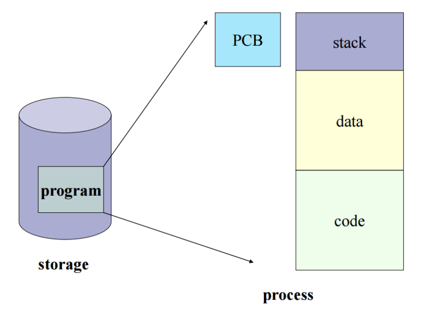

## PCB

- Process Management?
  - CPU 스켸줄링을 통해 여러개의 프로세스를 관리하는 것
  - 이 때, CPU는 각 프로세스들이 누군지 알아야 관리가 가능함
  - 프로세스들의 특징을 갖고있는 것이 바로 `Process Metadata`
  - `Process Metadata`
    - Process ID : 프로세스 식별번호
    - Process State : new/ready/running/waiting/terminated 등의 상태
    - Process Priority : 프로세스 우선순위 등과 같은 스켸줄링 관련 정보
    - CPU Registers : 프로세스의 레지스터 상태를 저장. CPU 내 범용 레지스터(AX, BX, CX, DX), 데이터 레지스터(SP, BP, SI, DI), 세그먼트 레지스터(CS, DS, ES, SS) 등이 갖고 있는 값
    - Owner : 계정 정보. CPU 사용 시간 정보 (Quantum), 각종 스켸줄러에 필요한 정보
    - 입출력 정보 : 프로세스 수행 시 필요한 주변 장치, 파일들의 정보
    - 기억장치 관리 정보 : 프로그램이 적재될 기억 장치의 상한치/하한치, 페이지 테이블 또는 세그먼트 테이블 등과 같은 정보
    - 프로그램 카운터(계수기) : 다음에 실행되는 명령어의 주소
  - 프로세스가 생성되면 `Process Meatadata`는  `PCB` 이라는 곳에 저장됨


- PCB?

  - 

  - 프로세스 제어 블록 (Process Control Block, PCB)

  - 특정 프로세스에 대한 중요한 정보를 저장하고 있는 운영체제의 자료구조

  - 운영체제는 프로세스를 관리하기 위해 **프로세스의 생성과 동시에 고유한 PCB를 생성**

    - ```
      프로그램 실행 → 프로세스 생성 → 프로세스 주소 공간에 (코드, 데이터, 스택) 생성 
      → 이 프로세스의 메타데이터들이 PCB에 저장
      ```

  - 프로세스는 CPU를 할당받아 작업을 처리하다가도 **프로세스 전환이 발생하면 진행하던 작업 저장하고 CPU 반환해야함**

    - 이 때, **작업의 진행 상황을 모두 PCB에 저장**
    - 그리고, **다시 CPU를 할당받게 되면 PCB에 저장되어있던 내용을 불러와 이전에 종료됐던 시점부터 다시 작업을 수행**

  

- PCB는 왜 필요한가?

  - CPU에서는 프로세스의 상태에 따라 교체작업이 이루어짐

    (인터럽트가 발생해서 할당받은 프로세스가 waiting상태가 되고, 다른 프로세스를 running으로 바꿔 올릴 때)

  - 이 때, 앞으로 다시 수행할 대기 중인 프로세스에 관한 저장 값을 PCB에 저장해둠


- PCB는 어떻게 관리되나?
  - Linked List 방식
  - PCB List Head에 PCB들이 생성될 때마다 붙게 됨
  - 주소값으로 연결
  - 삽입, 삭제가 용이함
  - 프로세스가 생성되면 해당 PCB가 생성되고, 프로세스 완료시 제거됨


> 참고
>
> https://github.com/gyoogle/tech-interview-for-developer/blob/master/Computer%20Science/Operating%20System/PCB%20%26%20Context%20Switcing.md
>
> https://github.com/JaeYeopHan/Interview_Question_for_Beginner/tree/master/OS
>
> https://m.blog.naver.com/adamdoha/222019884898