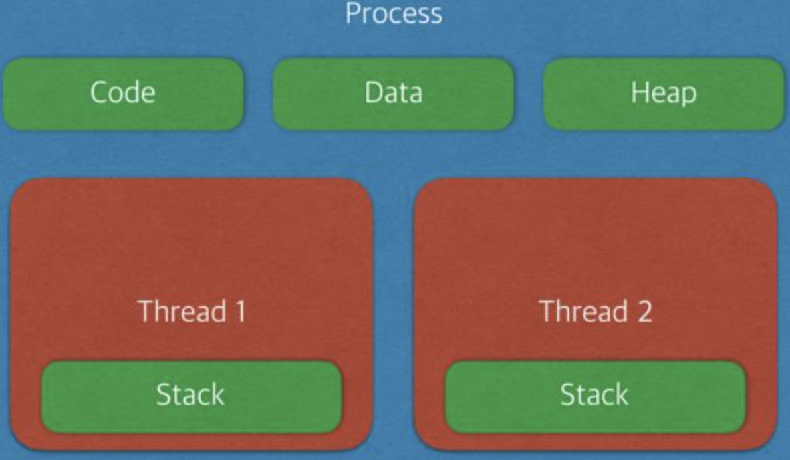

## 프로세스 vs 스레드

### 프로세스란?

- 프로그램?

  - 사전적 의미: 어떤 작업을 위해 실행할 수 있는 파일

- 프로세스?

  - 프로그램을 메모리 상에서 실행중인 작업

  - 디스크로부터 메모리에 적재되어 CPU의 할당을 받을 수 있는 것

  - 운영체제로부터 주소 공간, 파일, 메모리 등(시스템 자원)을 할당 받음 -> 다 합쳐서 ''프로세스''라고함

    - 할당 받는 시스템 자원: CPU 시간, 운영되기 위해 필요한 주소 공간, Code/Data/Stack/Heap 구조로 되어 있는 독립된 메모리 영역

    - **Code**: 코드 자체를 구성하는 메모리 영역 (프로그램 명령)

      **Data**: 전역 변수, 정적 변수, 배열 등

      ​	초기화 된 데이터는 data 영역에 저장

      ​	초기화 되지 않은 데이터는 bss 영역에 저장

      **Heap**: 동적 할당 시 사용 (new(), malloc() 등)

      **Stack**: 지역변수, 매개변수, 리턴 값 (임시 메모리 영역)

  - 프로세스마다 최소 1개의 스레드 소유 (메인 스레드 포함)

    - 하나의 프로세스 생성될 때, 기본적으로 하나의 스레드 같이 생성

  - **각 프로세스는 별도의 주소 공간에서 실행**됨. (**한 프로세스는 다른 프로세스의 변수나 자료구조에 접근할 수 없음**)

    - 한 프로세스가 다른 프로세스의 자원에 접근하려면 프로세스 간의 통신 (IPC, inter-process communication)을 사용해야 한다. (ex. 파이프, 파일, 소켓 등을 이용한 통신 방법 이용)

### 스레드란?

- 프로세스 내에서 실행되는 여러 흐름의 단위

- 프로세스가 할당받은 자원을 이용하는 실행의 단위

- **프로세스 내에서 각각 Stack만 따로 할당받고 Code/Data/Heap 영역은 공유**함

  - 

  - 프로세스 - 자신만의 고유 공간과 자원을 할당받아 사용 (다른 프로세스의 메모리에 직접 접근 불가능)

    스레드 - 다른 스레드와 공간, 자원을 공유하면서 사용

- 한 스레드가 프로세스 자원을 변경하면, 다른 이웃 스레드(sibling thread)도 그 변경 결과를 즉시 볼 수 있음

> 참고
>
> https://github.com/JaeYeopHan/Interview_Question_for_Beginner/tree/master/OS#%ED%94%84%EB%A1%9C%EC%84%B8%EC%8A%A4%EC%99%80-%EC%8A%A4%EB%A0%88%EB%93%9C%EC%9D%98-%EC%B0%A8%EC%9D%B4
>
> https://github.com/gyoogle/tech-interview-for-developer/blob/master/Computer%20Science/Operating%20System/Process%20vs%20Thread.md
>
> https://github.com/WeareSoft/tech-interview/blob/master/contents/os.md